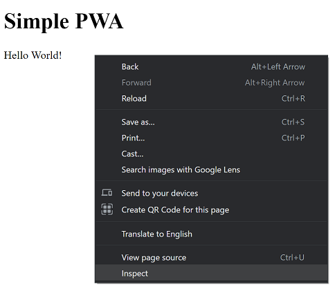
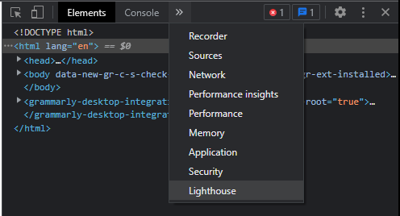
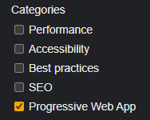
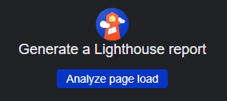
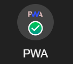

# Minimal PWA

The worst app ever!

## Minimal PWA Tutorial

1. Create `index.html`. This will serve as the launching point for the PWA and is stored in the root project directory.

   - The `<head>` tag needs to contain some metadata as well as reference to any outside resources like icons and
   stylesheets. The manifest must be referenced here.
   - The `<body>` tag must contain reference to any JavaScript required to control the app.
   - The rest of the document can be customized to suit the needs of the application.

   ### Sample `index.html`

   ```html
   <!DOCTYPE html>
   <html lang="en">
   <head>
       <meta charset="UTF-8">
       <meta name="theme-color" content="#db4938" />
       <meta name="viewport" content="width=device-width, initial-scale=1.0"/>
       <link rel="apple-touch-icon" href="images/icons/icon-192x192.png" />
       <link rel="apple-touch-icon" href="images/icons/icon-512x512.png" />
       <title>Simple PWA</title>
       <link rel="manifest" href="manifest.json" />
   </head>
   <body>
       <h1>Simple PWA</h1>
       <p>Hello World!</p>
       <script src="js/app.js"></script>
   </body>
   </html>
   ```

2. Add icons. PWAs require at least one maskable icon and at least one large icon (at least 512x512).

   

   Here are a couple of websites that can be used to generate PWA icons in all sizes for all platforms.
   - [PWA Builder - Image Generator](https://www.pwabuilder.com/imageGenerator)
   - [Crawlink - PWA App Icon Generator](https://tools.crawlink.com/tools/pwa-icon-generator/)

3. Create the manifest. The manifest provides some basic information about the application as a JSON text file.
   Icons are required for installable PWAs. Google further requires that at least one of the small icons is flagged
   as maskable. If no purpose is specified an icon's purpose will be *any*. Store `manifest.json` in the root project
   directory.

   ### Sample `manifest.json`

  ```json
   {
      "name": "Simple PWA",
      "short_name": "PWA",
      "display": "standalone",
      "start_url": "index.html",
      "background_color": "#ffffff",
      "theme_color": "#7b4b7d",
      "icons": [
         {
            "src": "images/icons/icon-192x192.png",
            "type": "image/png",
            "sizes": "192x192",
            "purpose": "maskable"
         },
         {
            "src": "images/icons/icon-512x512.png",
            "type": "image/png",
            "sizes": "512x512"
         }
      ]
   }
   ```

4. Create and register a **service worker**.

   ### Sample Service Worker
   The service worker must have event listeners for *install* and *fetch* at a minimum.
   ```javascript
   self.addEventListener("install", event => {
    console.log("Service worker installed", event);
   });
   
   self.addEventListener("fetch", event => {
    console.log("Service worker fetching...", event)
   })
   ```
   
   ### Registering the Service Worker
   The service worker must be registered in a JavaScript file linked in `index.html`.
   ```javascript
   if ('serviceWorker' in navigator) {
    navigator.serviceWorker.register("/minimal-pwa/serviceworker.js");
   }
   ```

5. Serve with HTTPs. PWAs must be served over HTTPs.

6. Test with lighthouse.

   

   Open your PWA in Google Chrome. Right-click the page and select inspect from the context menu.

   

   Google's dev tools should appear in the sidebar at the right of the screen. Select lighthouse from the list of
   options. If there is enough room, it will be visible. If not you may have to use the drop-down menu.

   

   Select *Progressive Web App* from the list of categories.

   

   Click *Analyze page load*

   

   Once the audit completes it will tell you which of the above steps you missed (if any). Otherwise you should see
   a success screen.

   

### Definitions

#### Maskable Icon
A **maskable icon** can be cropped to a variety of shapes depending on device. A well-designed maskable icon has
important graphical content within a specified safe zone so that the logo is not cropped in an undesirable way.

#### Lighthouse
**Lighthouse** is an open-source, automated tool for improving the quality of web pages.

#### Service Worker
A **service worker** is a script written in javascript that allows intercepting and control of network requests
and asset caching from the web browser.

#### Web App Manifest
A **web app manifest** provides information about a web application in a JSON text file, necessary for the web app
to be downloaded and be presented to the user similarly to a native app (e.g., be installed on the home screen
of a device, providing users with quicker access and a richer experience). PWA manifests include its name,
author, icon(s), version, description, and list of all the necessary resources (among other things).
Further information can be found in the [W3C Specification](https://w3c.github.io/manifest/).

### References

1. [W3C - Web Manifest Specification](https://w3c.github.io/manifest/)
2. [MDN - Web App Manifests](https://developer.mozilla.org/en-US/docs/Web/Manifest#:~:text=Web%20app%20manifests%20are%20part,homescreen%20without%20an%20app%20store.)
3. [Web.Dev - Service Workers](https://web.dev/learn/pwa/service-workers/#:~:text=Service%20workers%20are%20a%20fundamental,push%20notifications%2C%20and%20other%20capabilities.)
4. [Web.Dev - Maskable Icons](https://web.dev/maskable-icon/#:~:text=Maskable%20icons%20are%20a%20new,great%20on%20all%20Android%20devices.)
5. [Web.Dev - PWA Checklist](https://web.dev/pwa-checklist/)
6. [Maskable App](https://maskable.app/)
7. [PWA Builder - Image Generator](https://www.pwabuilder.com/imageGenerator)
8. [Crawlink - PWA App Icon Generator](https://tools.crawlink.com/tools/pwa-icon-generator/)
